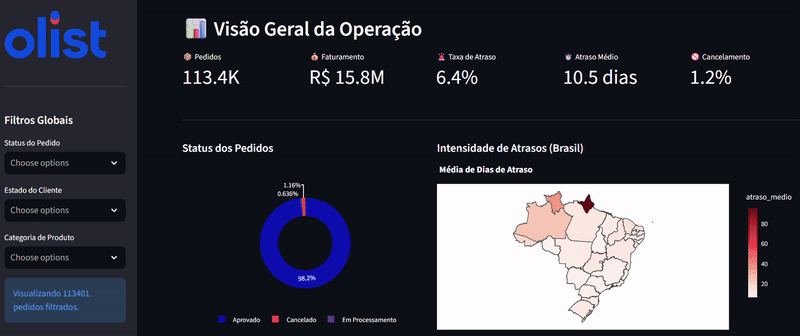
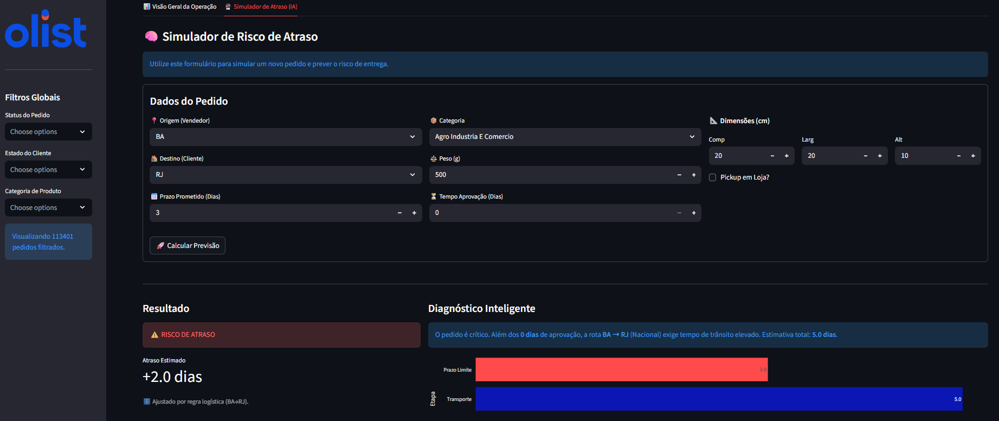

# 🚚 Olist Logistica Centro de Comando (End-to-End Data Science Project)

    

> 🚀 **Destaques do Projeto:** Este portfólio demonstra domínio em **Full-Stack Data Science**: da engenharia de dados (ETL robusto e Feature Engineering) à construção de pipelines de **Machine Learning** e **Deploy** de aplicações web. Evidencia forte capacidade analítica em **Supply Chain & Logística**, aliada a boas práticas de **Engenharia de Software** (modularização, código limpo e controle de versão), provando aptidão para resolver problemas de negócio complexos de ponta a ponta.
---

## 🟢 Acesse a Aplicação Online

Interaja com o Dashboard e o Simulador em tempo real (sem instalações):

[](https://olist-logistics.streamlit.app/)
*(Nota: O carregamento inicial pode levar alguns segundos devido ao "cold start" do servidor gratuito)*

---

## 📸 Visão Geral da Solução

### 1. Dashboard de Controle Operacional
Monitoramento de KPIs críticos como **Loss Rate**, **Atraso Médio** e **Heatmap de Gargalos Logísticos** no Brasil.

  
*(Visão geral da Aba 1: Métricas e Mapas)*

### 2. Simulador Preditivo com "Smart Guardrails" 🧠
Diferente de modelos tradicionais, este simulador combina **Random Forest** com **Regras de Negócio (Logística Regional)**.
* **O Modelo:** Prevê o tempo estatístico baseado no histórico.
* **O Guardrail:** O sistema valida se a rota (ex: Sul -> Norte) respeita o tempo físico mínimo (Logística Complexa), evitando "alucinações" da IA em rotas longas.

  
*(Visão da Aba 2: Previsão de risco com gráfico waterfall explicativo)*

---
## 💼 Contexto e Problema de Negócio
A **Olist** atua como uma grande loja de departamentos dentro de marketplaces, conectando pequenas empresas a clientes finais. Nesse modelo, a logística é descentralizada e complexa.

**O Problema:** Atrasos na entrega são a principal causa de insatisfação (Churn) e custos operacionais (Reclamações/SAC).
**A Solução:** Uma "Torre de Controle Logístico" composta por:
1.  **Dashboard Analítico:** Para monitoramento de KPIs em tempo real (Loss Rate, Atraso Médio, Faturamento).
2.  **Motor de Previsão (IA):** Um modelo preditivo que estima o risco de atraso *antes* da compra ser finalizada, permitindo alinhar expectativas de prazo com o cliente.

---

## 🛠️ Pipeline do Projeto (Metodologia)
O projeto segue o ciclo de vida completo de Ciência de Dados:

### 1. Engenharia de Dados (ETL)
* **Fonte:** Dados públicos do E-commerce Brasileiro (Kaggle).
* **Limpeza Avançada:**
    * Tratamento cronológico: Remoção de inconsistências (ex: entregas registradas antes da compra).
    * Segmentação de Nulos: Diferenciação entre pedidos em andamento e erros sistêmicos (Ruído).
* **Feature Engineering:** Criação de variáveis como `volume_cubico`, `tempo_aprovacao` e `densidade_rota`.

### 2. Análise Exploratória (Insights) 📊
Aprofundando nos dados, descobri padrões cruciais para a operação:
* **Desigualdade Regional:** Enquanto o Sudeste opera com prazos otimizados, regiões Norte e Nordeste apresentam SLA de entrega até **3x maior**, sugerindo a necessidade de CDs (Centros de Distribuição) locais.
* **O "Gargalo Invisível":** Pedidos com longo `tempo_aprovacao` (pagamento/análise de crédito) têm correlação direta com atrasos na entrega. O relógio logístico começa a correr, mas o produto fica parado.
* **Impacto de Categorias:** Itens de "Móveis e Decoração" possuem alto índice de sinistro logístico devido à complexidade de cubagem e peso, exigindo transportadoras especializadas.
* **Cancelamento vs. Atraso:** A taxa de cancelamento dispara exponencialmente quando o pedido supera 5 dias de atraso.

### 3. Machine Learning 🤖
* **Objetivo:** Regressão para prever `dias_de_atraso` (ou margem de segurança).
* **Algoritmos Testados:** Linear Regression, XGBoost e Random Forest.
* **Modelo Campeão:** `RandomForestRegressor`.
* **Performance:** O modelo alcançou um MAE (Erro Médio Absoluto) competitivo, capaz de diferenciar com precisão rotas de risco (ex: SP -> AM) de rotas seguras (ex: SP -> SP).

### 3.1 Otimização de Hiperparâmetros (Fine-Tuning) 🧠
Para elevar a performance do modelo, implementei uma etapa de ajuste fino utilizando `RandomizedSearchCV`. Esta abordagem permitiu explorar um vasto espaço de parâmetros de forma computacionalmente eficiente.

* **Estratégia:** Comparei o desempenho de **Random Forest** e **XGBoost** através de validação cruzada (`3-fold CV`).
* **Métrica Primária:** Otimizei os modelos com foco no **MAE (Erro Médio Absoluto)**. Diferente do RMSE, o MAE é mais robusto a outliers e oferece uma interpretação direta para o negócio: a média de dias de erro na previsão da entrega.
* **Resultado do Tuning:** * **Random Forest (Campeão):** Reduziu o erro para **4.76 dias**.
    * **XGBoost:** Apresentou um erro residual de **4.85 dias**.
* **Melhores Parâmetros (RF):** `n_estimators: 200`, `min_samples_leaf: 2`, `max_depth: 30`.

> **Insight Técnico:** A Random Forest otimizada mostrou-se superior para este volume de dados, lidando melhor com a alta dimensionalidade gerada pelo tratamento de rotas logísticas complexas.

### 4. Deploy (Aplicação Final)
Desenvolvimento de uma Web App em **Streamlit** simulando uma ferramenta de gestão:
* **Simulador:** O usuário insere origem, destino e dimensões; o modelo retorna a previsão de dias em tempo real.
* **Arquitetura:** Uso de `utils.py` para modularização e garantia de consistência entre o treinamento e a aplicação.

---

## 🚀 Como Executar o Projeto

### Pré-requisitos
* Python 3.9 ou superior.
* Git (recomendado ter Git LFS instalado para baixar o modelo).
* Conta no Kaggle (para download dos dados).

### Passo 1: Clonar o Repositório
```bash
git clone [https://github.com/anapaulads/anapaulads-Analise-e-Modelagem-Preditiva-de-Performance-Logistica.git](https://github.com/anapaulads/anapaulads-Analise-e-Modelagem-Preditiva-de-Performance-Logistica.git)
cd anapaulads-Analise-e-Modelagem-Preditiva-de-Performance-Logistica
```

### Passo 2: Criar Ambiente Virtual (Recomendado)
É altamente recomendado criar um ambiente virtual para isolar as dependências:

**Windows:**
```bash
python -m venv .venv
.venv\Scripts\activate
```

**Linux/Mac:**
```bash
python -m venv .venv
source .venv/bin/activate
```

### Passo 3: Instalar Dependências
Escolha a opção adequada para o seu objetivo:

**Opção A: Apenas rodar o Dashboard (Modo Produção/Leve)**
Use este comando se quiser apenas visualizar a aplicação rodando (igual ao servidor).
```bash
pip install -r requirements.txt
```

**Opção B: Desenvolvimento Completo (Modo Dev)**
Use este comando se quiser rodar os Jupyter Notebooks, re-treinar modelos e contribuir com o código.
```bash
pip install -r requirements-dev.txt
```

### Passo 4: Configuração da API Kaggle (Dados)
Este projeto baixa os dados brutos automaticamente via API. Para configurar:
1. Crie uma conta no [Kaggle](https://www.kaggle.com/).
2. Vá em **Settings** > **API** > **Create New Token**.
3. Um arquivo `kaggle.json` será baixado.
4. **Coloque esse arquivo na pasta raiz deste projeto.**

### Passo 5: Executando
Com tudo configurado, inicie o Dashboard:
```bash
streamlit run app.py
```
O navegador abrirá automaticamente em `http://localhost:8501`.

## 🗂 Estrutura de Arquivos
```text
├── assets/                # Imagens do README
├── data/                  # Armazena os CSVs (Ignorado no Git, baixado via script)
├── models/                # Modelo treinado (.pkl)
├── notebooks/             # Jupyter Notebooks de desenvolvimento
│   ├── ETL_EDA_Logistics_Analytics.ipynb
│   └── Modelagem_Logistica.ipynb
├── utils/                 # Funções compartilhadas (ETL e App)
│   └── utils.py
├── app.py                 # Aplicação Streamlit (Dashboard + Simulador)
├── kaggle.json            # Credenciais do Kaggle (Adicione o seu aqui)
├── requirements.txt       # Bibliotecas necessárias para rodar o projeto
├── requirements-dev.txt   # Bibliotecas necessárias para rodar o projeto
└── README.md              # Documentação do projeto
```

## Contribuições
Sugestões, melhorias e novas ideias são bem-vindas!  
Sinta-se à vontade para abrir issues ou pull requests.

## ✒️ Autor

**Ana Paula Dias** *Data Scientist | Data Analyst*

Entre em contato para discutir este projeto ou oportunidades:

[](https://www.linkedin.com/in/anapauladss/)
[](mailto:contato.paulla@outlook.com)

---

## 📄 Licença
Este projeto está licenciado sob a Licença MIT - consulte o arquivo [LICENSE](LICENSE) para mais detalhes.

## 🙏 Agradecimentos
* **Olist:** Pela disponibilização pública do [Brazilian E-Commerce Public Dataset](https://www.kaggle.com/olistbr/brazilian-ecommerce) no Kaggle, que tornou este estudo possível.
